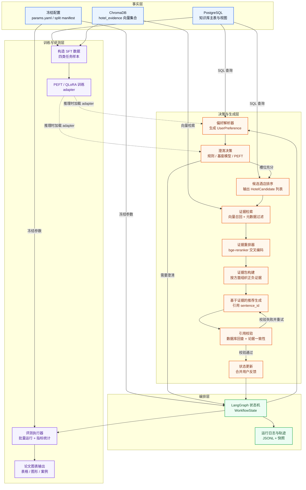
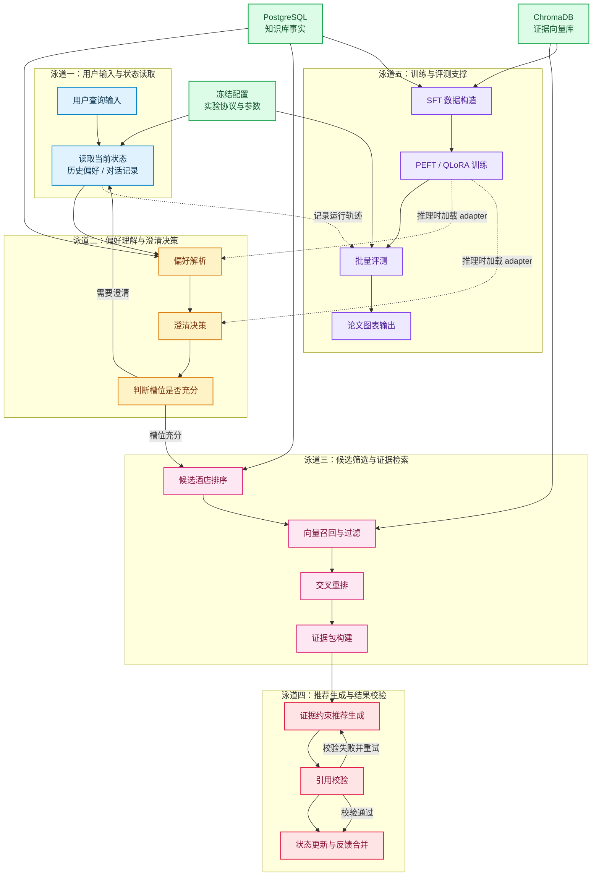

# 基于酒店评论知识库与参数高效微调的有状态会话式酒店推荐工作流研究：一月内可落地的论文结构、体系架构与对比实验全案

## 研究定位与可答辩的论文章节结构

你的现有方案已经把“研究什么/不研究什么”讲得很清楚：不是做开放式酒店 Agent，而是做**可回放、可追溯、可对比实验验证**的有状态推荐工作流；并且把变量拆成两条主线：**知识组织方式（Aspect-KB）**与**行为能力内化（PEFT）**。这与会话式推荐系统（CRS）典型的“偏好获取—多轮交互—推荐/解释”范式高度一致，且CRS研究强调系统往往是多组件、需要模块级可评测性与端到端一致的评估框架。

为了满足你的硬性要求（核心章节≥3–4章，且**每个核心章节都要有对比实验支撑其引入模块的价值**），建议把论文结构从“传统论文章节”改造成“**章节—模块—实验组—材料产出**一一对应”的写法：核心章节围绕你真正新增/主张的模块展开；实验章节不是从零开始讲，而是汇总各核心章节产出的对比结果并回答RQ1/RQ2。

下面给出一份“可直接搬到毕业论文目录”的章节结构（含每章必做对比实验矩阵），并刻意控制工作量：每章实验都复用同一套冻结的 split、query set、日志规范与评测脚本，避免你在一个月内同时维护多套评测体系。

### 推荐的论文章节分布与“章内对比实验”映射

| 章节（建议标题） | 本章主张/新增的“模块点” | 本章最少必须做的对比实验（章内实验） | 与RQ的关系 | 章内实验产物能直接变成什么论文材料 |
|---|---|---|---|---|
| 绪论 | 研究边界、RQ1/RQ2、2×2总体矩阵 | 不做核心实验（可放1个“系统演示案例”） | 交代问题和假设 | 研究问题、贡献点、边界清单 |
| 相关工作 | CRS、RAG、ABSA/评论知识结构化、PEFT | 不强制做实验（可做“方法对照表”） | 建立学术语境 | 文献对比表（方法、优缺点、你的定位） |
| 核心章一：数据与评论知识组织（Aspect-KB） | 句子证据、方面标签、情感、酒店方面画像（profile）作为“外置事实层” | **E1：方面/情感标注可靠性对照**；**E2：画像驱动的候选缩圈有效性对照** | RQ1 的“知识组织”基础 | 数据统计表、标注一致性、画像示例与误差分析 |
| 核心章二：有状态会话工作流与偏好解析 | UserPreference/WorkflowState、槽位归一、澄清触发、反馈更新 | **E3：偏好解析（槽位）对照**；**E4：澄清触发策略对照**；（可选）**E5：中文输入→英文检索表达桥接对照** | RQ2（行为能力）主战场 | 槽位F1、澄清准确率、状态更新案例（成功/失败） |
| 核心章三：候选排序与证据检索（RAG） | 结构排序、向量召回、元数据过滤、reranker、证据包 EvidencePack | **E6：证据检索“方面引导 vs 朴素召回”对照**；**E7：reranker有无对照**；**E8：主通道+兜底通道对照** | RQ1 的“检索与证据”落地 | Aspect Recall@K、MRR/nDCG（基于人工qrels）、证据多样性与失败归因 |
| 核心章四：证据约束生成与PEFT行为微调 | 引用校验、证据约束prompt、PEFT提升“偏好解析/澄清/约束遵守/证据式表达” | **E9：生成策略对照（无约束 vs 证据约束 vs 校验重试）**；**E10：Base vs PEFT 行为对照（统一输入、统一证据）** | RQ2 + “最终可见输出可信度” | Citation precision、可验证性评分、Base/PEFT差异案例 |
| 实验汇总与讨论 | 2×2主矩阵四组（G1–G4）统一汇总 | 汇总主矩阵 + 最少必要消融 | 直接回答RQ1/RQ2 | 总表、显著性/置信区间、结论与局限 |
| 总结与展望 | 结论回扣、边界诚实、未来可扩展 | 不做新实验 | 论文收口 | 贡献点+局限性列表 |

其中“章内实验”的设计思想来自CRS与RAG系统评估的共识：**多组件系统必须兼顾组件级与端到端评估**，否则容易出现“端到端看似提升但无法解释原因”的答辩漏洞。

---

## 工作流体系架构与模块输入输出设计

你现在的问题不是缺模块，而是“路线性不够一眼看懂”。要一次性解决“架构不清晰”“复杂度不够”“答辩容易被拷打”，建议将系统明确拆成三套“可以被审问”的工件：

1) **运行时架构（Runtime Architecture）**：系统怎么跑、哪些组件负责什么。  
2) **状态机图（State Machine / LangGraph）**：每一轮对话走哪些节点、条件分支是什么、状态如何更新。LangGraph本身就是面向“有状态、长运行工作流编排”的框架定位，用它来解释“为什么不是开放Agent loop”会更站得住。
3) **数据契约（Data Contracts）**：每个模块输入输出结构体（UserPreference/HotelCandidate/EvidencePack/RecommendationResponse/WorkflowState），再配合“结构化输出”来保证可解析、可验证。LangChain文档明确支持用 JSON Schema/Zod 等做结构化输出，这对你的一月交付非常关键（否则你会死在JSON解析和输出漂移上）。

### 运行时架构图多版本（供论文插图选型）

#### 版本A：上下分层总览图（现有基础版）

这张图的“复杂度”来自两点：  
第一，它把你强调的“知识外置、行为内化”画成了**数据流方向**：事实只从PG/Chroma出来，而不是从模型参数里“凭空产生”，这与RAG提出的“显式非参数记忆可提供来源与可更新性”的动机一致。 
第二，它把“可验证”做成了一个明确的“引用校验”模块：如果没有这一步，你的“引用准确率”与“证据可验证性”就很容易停留在口号层面。

#### 版本B：左到右分层架构图（论文正文优先版）
这一版更强调“层次结构”而不是“执行先后”，适合放在论文的方法总览部分。读者会先看到事实资源层，再看到状态编排、在线决策、证据检索、生成校验与训练评测之间的依赖关系，整体更接近正式论文里常见的系统架构图风格。

```mermaid
flowchart LR
  subgraph FACT2["事实资源层"]
    direction TB
    BPG["PostgreSQL<br/>酒店、评论、句子、方面画像"]
    BCH["ChromaDB<br/>句子级证据向量索引"]
    BCFG["冻结配置<br/>城市 / 方面 / split / top-k"]
  end

  subgraph ORCH2["状态与编排层"]
    direction TB
    BLG["LangGraph 工作流状态机<br/>维护 WorkflowState"]
    BLOG["运行日志与实验轨迹<br/>JSONL + snapshots"]
  end

  subgraph DECIDE2["在线决策层"]
    direction TB
    BPARSE["偏好解析与槽位归一"]
    BCLF["澄清决策"]
    BRANK["候选酒店排序"]
  end

  subgraph RETR2["证据检索层"]
    direction TB
    BRET["向量召回与元数据过滤"]
    BRER["交叉编码重排"]
    BPACK["证据包构建<br/>按方面组织正负证据"]
  end

  subgraph GEN2["生成与校验层"]
    direction TB
    BGEN["证据约束推荐生成"]
    BVERIFY["引用校验与失败重试"]
    BUPDATE["状态更新与反馈合并"]
  end

  subgraph EVAL2["训练与评测层"]
    direction TB
    BSFT["SFT 数据构造<br/>四类任务样本"]
    BPEFT["PEFT / QLoRA 训练"]
    BEVAL["批量评测与指标统计"]
    BREPORT["论文表格与图形输出"]
  end

  BPG -->|SQL 查询| BPARSE
  BPG -->|SQL 查询| BRANK
  BCH -->|向量检索| BRET
  BCFG -->|冻结参数| BLG
  BCFG -->|冻结参数| BEVAL

  BLG --> BPARSE --> BCLF
  BCLF -->|需要澄清| BLG
  BCLF -->|可直接推荐| BRANK --> BRET --> BRER --> BPACK --> BGEN --> BVERIFY
  BVERIFY -->|校验通过| BUPDATE --> BLG
  BVERIFY -->|校验失败并重试| BGEN
  BLG --> BLOG

  BPG --> BSFT
  BCH --> BSFT
  BSFT --> BPEFT
  BPEFT -.->|推理时加载 adapter| BPARSE
  BPEFT -.->|推理时加载 adapter| BCLF
  BLG --> BEVAL --> BREPORT

  classDef fact2 fill:#E0F2FE,stroke:#0284C7,color:#082F49,stroke-width:1.5px;
  classDef orch2 fill:#DCFCE7,stroke:#16A34A,color:#14532D,stroke-width:1.5px;
  classDef decide2 fill:#FEF3C7,stroke:#D97706,color:#78350F,stroke-width:1.5px;
  classDef retr2 fill:#FCE7F3,stroke:#DB2777,color:#831843,stroke-width:1.5px;
  classDef gen2 fill:#FFE4E6,stroke:#E11D48,color:#881337,stroke-width:1.5px;
  classDef eval2 fill:#EDE9FE,stroke:#7C3AED,color:#4C1D95,stroke-width:1.5px;

  class BPG,BCH,BCFG fact2;
  class BLG,BLOG orch2;
  class BPARSE,BCLF,BRANK decide2;
  class BRET,BRER,BPACK retr2;
  class BGEN,BVERIFY,BUPDATE gen2;
  class BSFT,BPEFT,BEVAL,BREPORT eval2;
```

这版的优点是层次边界非常清晰，特别适合放在论文第三章“系统总体设计”开头，帮助导师快速理解“每一层干什么、层与层之间如何交互”。相对而言，它对“单轮会话是如何一步步流动的”表现得没有泳道式流程图那么强。

#### 版本C：泳道式流程图（工作流叙事优先版）
这一版更强调“单次推荐从哪里开始、经过哪些模块、在哪些位置分叉与回流”，适合放在方法流程说明或答辩展示中。虽然 Mermaid 本身并没有原生泳道图语法，但可以用分行子图模拟“泳道式”阅读体验。

这版的优点是流程感很强，特别适合解释“为什么系统是有状态工作流，而不是开放式 Agent”，因为它清楚展示了澄清分支、推荐主路径、引用校验回路与训练评测支撑链路。相对而言，它对整体系统分层的表达不如左到右分层图那么紧凑。

#### 多版本选型建议
为了方便你后续直接保留其中一版，下面给一个很实用的选型参考：

| 版本 | 最适合放置位置 | 主要优点 | 主要不足 |
| --- | --- | --- | --- |
| 版本A：上下分层总览图 | 方法总览页、开题报告、阶段规划文档 | 信息完整，兼顾事实层、编排层、生成层与训练层 | 视觉重心略偏“工程总览”，论文插图感中等 |
| 版本B：左到右分层架构图 | 论文第三章“系统总体设计”首页 | 分层清楚、结构规整、最像正式论文架构图 | 对流程分支和回流的强调稍弱 |
| 版本C：泳道式流程图 | 论文方法流程小节、答辩演示页 | 工作流叙事最强，最能解释澄清、回流与校验闭环 | 图面更长，作为“总图”时略显展开 |

### 关键数据契约（模块I/O 的最小可答辩版本）

建议在论文中给出“字段级别”的契约表（越具体越不容易被拷打）。下面是精简但足够支撑实验的版本。

**UserPreference（偏好状态）**  
`{ city, state?, hotel_category?, focus_aspects[], avoid_aspects[], trip_type?, unsupported_requests[], constraints_conflicts[], language, query_en }`

**HotelCandidate（候选酒店）**  
`{ hotel_id, hotel_name, score_total, score_breakdown{aspect_scores..., rating, popularity}, matched_aspects[] }`

**EvidencePack（证据包）**  
`{ query_en, hotel_id, hotel_name, evidence_by_aspect{aspect: [SentenceCandidate...]}, neg_evidence_by_aspect?, retrieval_trace{topk_before, topk_after, filters, channel(main/fallback)} }`

**RecommendationResponse（输出）**  
`{ hotel_id, hotel_name, recommendation_text, cited_sentence_ids[], cited_quotes[], unsupported_note, safety_note? }`

**WorkflowState（全局状态）**  
`{ turn, preference, pending_clarification?, last_candidates?, last_evidence_packs?, recommendations?, feedback_history[], conversation_history[], run_config_hash }`

**为什么一定要结构化输出？**  
因为你要做大量离线评测与对比实验。“能跑一次”不难，“能稳定跑100条query并批量算指标”才是难点。LangChain的结构化输出能力就是为“可解析、可验证、可集成”设计的。

---

## 核心章节对比实验的细节设计与可执行流程

这一部分按你的要求给出“实验做什么、怎么做、流程细节、数据切分、指标”，并且每个实验都尽量满足：  
同一评测资产（split/query set）复用；对照组只改关键自变量；输出能沉淀为论文表格/图/案例。

### 全局实验冻结协议（所有章节共用）

**数据切分（强烈建议按 hotel_id 分割）**  
你的方案已经警惕“训练-测试酒店泄漏”。这一点必须升级成硬规则：**所有训练（含SFT）只用训练酒店；所有对比实验以测试酒店为主；开发调参只用dev酒店**。这样你才能解释“PEFT提升的是行为能力，而非记住某家酒店”。（LoRA/QLoRA属于高效微调范式，但依然可能发生记忆泄漏，因此切分纪律是第一道防线。）

推荐切分方式（示例逻辑）：  
- 146家酒店按 city 分层抽样，再按 hotel_id 划分 `train/dev/test = 70/15/15`。  
- 把切分清单写成 `frozen_split_manifest.json`，所有脚本只能读取，不允许动态重采样。

**评测Query集（小而强约束）**  
建议固定一个 `judged_queries.jsonl`，每条包含：  
- 中文原始query（模拟真实交互）  
- gold slots（city、focus_aspects、avoid、category、unsupported_requests）  
- 是否“应澄清”（gold clarify_needed）  
- 评测类型标签：single-aspect / multi-aspect / conflict / unsupported-heavy / feedback-turn 等

CRS评估文献强调“评估往往要针对偏好获取、对话策略、推荐质量分开看”，你的Query集标签化可以让你在论文里分桶讨论。

**日志与可复现**  
每次运行必须产出：  
`{run_id, group(G1..G4), model(base/peft), retrieval_mode(plain/aspect), query_id, intermediate objects, final response, latency, config_hash}`  
否则后期你无法做失败归因。

---

### 核心章一：数据与评论知识组织（Aspect-KB）

这一章要证明：你构建的方面/情感/画像不是“多建几张表”，而是**可验证地提升后续推荐链路的可解释性和检索可控性**。酒店评论按方面组织用于个性化推荐与信息聚合在研究与应用中都有明确动机（酒店评论常见方面如位置、清洁、服务等）。

#### E1：方面/情感标注可靠性对照实验

**目的**  
回答“你的方面标签和情感标签是否可信？噪声有多大？是否会污染后续实验？”这会直接堵住答辩中最常见的质疑：“你后面所有指标提升是不是因为标签错了/偏了？”

**对照组设计（自变量：标注策略）**  
- A：规则关键词（rule-only）  
- B：zero-shot 模型（zs-only）  
- C：你当前的“规则 + zero-shot 合并/兜底”（hybrid，现状）  

（你现有方案里已经是混合策略，但论文里必须用对照证明“混合”不是拍脑袋。）

**数据与标注量（控制工作量）**  
从测试集酒店的句子中，按6个核心方面分层抽样：  
- 每个方面抽 50 句，共 300 句；额外抽 60 句“多方面/含糊句”作为困难集。总计约 360 句。  
人工标注字段：`aspect_gold`（可多选）、`sentiment_gold`（pos/neg/neutral/unclear）、`is_multi_aspect`。

**指标**  
- Aspect：macro-F1（多分类）+ multi-label Jaccard（困难集）  
- Sentiment：macro-F1  
- 误差分析：混淆矩阵（特别关注 location vs value、service vs room_facilities 等近邻方面）

**流程（可直接写进论文）**  
1) 抽样脚本生成 `aspect_sentiment_eval_sample.csv`（含 sentence_id、text、hotel_id、source）  
2) 人工标注（可用表格工具），形成 `aspect_sentiment_gold.csv`  
3) 三种策略分别推理输出预测标签  
4) 计算指标并输出混淆矩阵 + 若干代表性错误案例（每类5条）

**为什么这个实验必要**  
因为你后续的候选排序、证据分组、Aspect Recall 等都依赖这些标签；先做E1等于给整个论文的可信度打地基。

#### E2：画像驱动候选缩圈的有效性对照实验

**目的**  
证明“hotel_aspect_profile”用于缩圈/排序是有效的，不是徒增复杂度。

**对照组（自变量：候选缩圈方法）**  
- A：不使用画像；仅按 `avg_rating` + `review_count` 排序（弱基线）  
- B：使用画像 `final_aspect_score`（你的主方法）  
- C（可选）：画像 + 负向惩罚/争议项消融（去掉 controversy penalty）

**评价口径（避免“排序自证循环”）**  
你不能用“画像分数高所以排序好”来评价。更稳妥的做法是把评价落到“下游证据质量与解释质量”上：  
- Candidate Hit@N：对每条query，在Top-N候选中是否能找到至少1家酒店，其证据包中对每个 focus_aspect 能召回≥M条“人工判定相关证据”（此处相关性来自E6的qrels池化标注，见后文）。  
- Efficiency：缩圈后检索调用量/耗时下降（这在工程答辩也很加分）。

**流程**  
1) 冻结 query set（只用 test queries）  
2) 在 A/B/C 三种候选策略下，统一调用同一证据检索模块（固定topk、reranker）  
3) 对每条 query 统计 Hit@N、耗时，输出表格和箱线图

---

### 核心章二：有状态会话工作流与偏好解析

CRS研究中，“偏好获取（preference elicitation）”和“恰当提问/澄清”是决定系统效率与体验的关键组件之一。你要在这一章把“状态”从口号变成可测量对象：槽位是否更准、澄清是否更该问才问、反馈是否真的更新了可执行约束。

#### E3：偏好解析（槽位填充）对照实验

**目的**  
验证 RQ2 的核心前提：PEFT主要提升“行为”（结构化解析、约束识别），而不是酒店知识。

**对照组（自变量：解析器）**  
- A：规则/字典解析（regex + 城市/方面词表）  
- B：Base LLM + 结构化输出（JSON Schema）  
- C：PEFT LLM + 结构化输出（同一schema）  

结构化输出能力建议用LangChain的 schema 约束方式，减少格式漂移。citeturn3search1

**数据**  
使用 `judged_queries.jsonl` 的“首轮query”（不含反馈），建议至少 80 条（10城×8条），覆盖：  
- 单方面（30%）  
- 多方面组合（40%）  
- 含不支持约束（20%）  
- 冲突/含糊（10%）

**指标**  
- Slot-F1（逐槽位：city、hotel_category、focus_aspects、avoid、unsupported_requests）  
- Exact-Match Rate（所有关键槽位都正确才算对）  
- Unsupported detection recall（特别重要：识别到预算/距离/入住日期但声明不执行）

**流程**  
1) 统一prompt与schema  
2) 三组对同一query批量推理，保存解析JSON  
3) 与gold对比计算指标  
4) 把错误按类型聚类：城市缺失、方面映射错误、不支持约束漏检、把不支持当支持（高危）

#### E4：澄清触发策略对照实验

**目的**  
证明“有状态工作流”不是为了炫技，而是能减少无效提问/避免在信息不足时胡荐。

**对照组（自变量：clarify决策）**  
- A：启发式规则（如 city 缺失→澄清；focus_aspects为空→澄清；输入主要是不支持约束→澄清）  
- B：Base LLM 判断 clarify_needed + 生成澄清问题  
- C：PEFT LLM 判断 clarify_needed + 生成澄清问题  

澄清问题质量本身可参考“好问题应带来信息增益”的研究思路，但本科项目只需做到可评测可解释即可。

**数据**  
从 query set 中挑出 “应澄清/不应澄清”各 40 条（总80）。

**指标**  
- Clarification Trigger Accuracy / Precision / Recall / F1  
- Over-clarification rate（不该问却问）与 Under-clarification rate（该问却不问）分开统计（答辩时很好讲）

**流程**  
1) 对每条query，让策略输出：`clarify_needed` + `question`（若needed）  
2) 与gold对比算指标  
3) 抽样人工评估10条澄清问题的“可回答性/针对性”（简易1–3分）

#### E5（强烈建议做）：中文输入→英文检索表达桥接对照实验

你方案中的“中文交互—英文检索”是关键，但目前是“建议”，还缺一个硬证据证明它必要。考虑到你向量模型是英文BGE（并且是以英文检索使用建议为核心的embedding模型体系），直接用中文query做dense retrieval往往会出现语义对齐问题；跨语言检索评估领域也长期讨论“翻译式CLIR vs 多语向量”的权衡。

**对照组（自变量：检索query语言策略）**  
- A：直接用中文query做向量检索（baseline）  
- B：用解析后的结构化槽位生成简洁英文query_en（你的主策略）  
- C（可选）：换成多语向量模型（如BGE-M3）但保持其他不变（如果你不想改索引，可只在小样本做对照）

**指标（轻量但说明问题）**  
- Evidence Aspect Recall@K（是否命中目标方面）  
- 证据相关性人工评分（每条query只评Top-5证据即可）

**流程**  
1) 固定候选酒店集合（避免把变量扩散到排序）  
2) 三种query策略分别检索同一候选集合内证据  
3) 计算命中率 + 抽样人工核验

---

### 核心章三：候选排序与证据检索（RAG）

RAG的核心思想是把“非参数知识库”作为模型生成时的外部依据，从而提高事实性并提供来源；但RAG系统评估也明确指出：**必须同时评估检索质量与生成质量**，否则无法定位问题。 你这一章要把“Aspect-KB Guided RAG”从概念落实到可量化差异。

此外，你使用的BGE体系在公开说明中明确建议：embedding召回后再用 cross-encoder reranker（bge-reranker）重排以提升精度；这为你做“reranker消融”提供了强动机来源。

#### E6：证据检索“方面引导 vs 朴素召回”对照（RQ1核心）

**对照组（自变量：检索组织方式）**  
- A：Plain Sentence RAG：仅用语义检索，不做 aspect 过滤/分组  
- B：Aspect-aware Retrieval：用元数据过滤（aspect、hotel_id、city）+ 按方面分组返回证据

Chroma 明确支持在 query 时用 `where` 进行元数据过滤，这正好支撑你“aspect-aware retrieval基于主标签过滤”的实现路线。

**关键：如何构建可评测的qrels（不让实验沦为自说自话）**  
你不能用系统自己的 aspect 标签当唯一真值。可行的“小规模强约束”办法是 **pooling**：  
1) 对每条query，A/B两种方法各取Top-10证据，合并去重得到证据池（通常≤20句）。  
2) 人工对池中每句证据标注：  
   - relevance（0/1/2）  
   - aspect_match（是否对应目标方面）  
   - polarity_match（是否与用户偏好/avoid一致）  
3) 把这个人工标注当作 qrels，用于 MRR/nDCG、Aspect Recall@K、Precision@K。

**工作量控制**  
- 选 50 条query做qrels（已经足够写本科论文并做统计），每条约20句 → 约1000句标注。  
- 这比标注“全库相关性”可控得多。

**指标**  
- Aspect Recall@K（K=5/10）  
- nDCG@K / MRR@K（基于relevance 0/1/2）  
- Evidence Diversity（同一hotel内证据来自不同review_id比例，防止重复句灌水）

**输出**  
这组实验能直接产出论文中最重要的一张表：B相比A在“方面命中与证据相关性”上的提升，以及典型失败案例（例如主标签单一导致漏召回）。

#### E7：reranker有无对照实验（检索链路消融）

**对照组（自变量：是否使用reranker）**  
- A：dense top_k_before=20 直接截断 top5  
- B：dense top20 → bge-reranker 重排 → top5

BGE官方模型页明确提出 reranker 作为更强的 cross-encoder，可用于重排embedding召回结果。

**指标**  
复用E6的qrels：nDCG@5、MRR@5、Precision@5，并报告延迟开销（让工程价值更立得住）。

#### E8：主通道 + 兜底通道对照（解决单标签元数据的结构缺陷）

你方案里已经意识到：Chroma 元数据只有“主方面标签”，多方面句会被单标签化。你的“主通道+兜底通道”非常好，但要用实验把它变成“合理补丁”而不是“拍脑袋”。

**对照组**  
- A：只走主通道（严格aspect过滤）  
- B：主通道不足时触发兜底（不加aspect过滤，仍在候选酒店内）  

**触发规则必须冻结**（否则有人会质疑你“调参调出来的”）：例如  
- 某方面主通道证据 < 2 条，或 top1 rerank score < 阈值T，或 top5句来自同一review过于同质化  
阈值只用dev set调一次，然后冻结。

**指标**  
- “证据不足率”降低多少（多少query的某方面无法提供足够证据）  
- nDCG@5是否提升  
- 同时报告“噪声上升多少”（兜底召回的不相关率）

---

### 核心章四：证据约束生成与PEFT行为微调

这一章要把两件事讲清楚：  
1) 你如何强制“生成必须有证据来源”（否则RAG就只剩形式）。RAG最初就强调“来源/provenance”和知识可更新是重要动机之一。
2) 你如何用PEFT/QLoRA在资源受限下提升“会话行为能力”。LoRA提出通过低秩适配减少可训练参数；QLoRA进一步通过4-bit量化+LoRA显著降低显存需求。 结合 Transformers 文档，bitsandbytes可用于4-bit量化以降低内存占用。

#### E9：生成策略对照（无约束 vs 证据约束 vs 校验重试）

**对照组（自变量：生成约束强度）**  
- A：自由生成（给候选酒店列表，但不强制引用sentence_id）  
- B：证据约束生成（输入EvidencePack，要求“每个理由必须引用sentence_id”）  
- C：证据约束 + Citation Verifier（若引用ID不存在/不在pack中→重试或降级输出）

**指标**  
- Citation Precision（引用的 sentence_id 是否真实存在于DB，并且是否属于本次EvidencePack）  
- Evidence Verifiability（人工 0/1/2：句子是否支持对应理由；你在方案里已提出这个指标，推荐用更严格的rubric落地）  
- Unsupported honesty rate（对不支持约束是否透明说明）

**实现细节（避免被拷打）**  
- Citation Verifier要做两层校验：  
  1) **ID存在性**（PostgreSQL查得到 sentence_id）  
  2) **上下文一致性**（该 sentence_id 是否在本轮EvidencePack里；否则属于“越权引用”）  
- 如果你愿意再加一层：用简单字符串对齐（生成文本里提到的方面与证据的aspect字段是否一致）作为弱校验。

#### E10：Base vs PEFT 行为对照（统一输入、统一证据）

这是回答RQ2最关键的一步：要证明PEFT提升的不是“酒店知识”，而是“解析/澄清/遵守约束/证据式表达”等行为。

**对照设计（强控制变量）**  
- 同一条输入query  
- 同一份UserPreference（可直接用gold preference 或固定解析输出）  
- 同一份EvidencePack（完全固定，不让retrieval波动影响）  
- 仅替换生成模型：Base vs PEFT

这样你测到的差异才更可能真的是“行为学习”，而不是上游检索波动导致的。

**指标（行为型）**  
- Output schema compliance（输出是否严格包含 required fields）  
- Instruction adherence：是否按要求引用、是否透明声明不支持约束  
- Faithfulness / groundedness：可使用RAG评估框架中的“faithfulness/groundedness”类指标作为辅助，但务必在论文里说明其是 LLM judge 或半自动评估，有偏差风险。RAG评估综述指出评估RAG并不简单，需要多维度（检索、生成、端到端）共同衡量；Ragas文档也提供 context precision/recall、faithfulness 等可用于组件评估。

---

## 现有方案最容易被质疑的核心缺陷与可执行优化

下面按“答辩最常见拷打点”列出你方案当前最危险的缺陷，并给出一月内可落地的修补策略（尽量不引入新的大工程）。

### 缺陷是没有“冻结评测资产”的硬协议，导致任何结果都像调参调出来的

**风险表现**：你说“2×2主实验”，但如果query集、prompt、topk、阈值、reranker版本、split 在不同组里悄悄变过，老师会直接判你“伪对照”。

**优化**：建立一份“冻结清单”（必须写进论文实验设置一节），至少包括：  
- `frozen_split_manifest.json`（按hotel_id）  
- `judged_queries.jsonl` + `slot_gold.jsonl` + `clarify_gold.jsonl`  
- `prompt_version_id`（每个模块prompt必须版本化）  
- `retrieval_config_hash`（topk、filters、reranker、embedding模型）  
- `model_id`（base/peft路径）

### 缺陷是候选排序的评价容易陷入“自证循环”

你用画像分数排序，再用画像分数证明排序好，会被认为循环论证。

**优化**：把候选排序的价值落到**下游可验证目标**：  
- 缩圈后证据质量（qrels指标）是否更好  
- 端到端推荐输出的可验证性是否更强  
- 同时减少检索成本（调用量/耗时）  
这样排序模块的贡献就能被“可解释的工程收益+可验证的证据收益”双重支撑。

### 缺陷是“中文交互—英文检索”属于关键假设，但目前缺乏实验验证

**风险表现**：别人会问“你为什么不用多语embedding？你凭什么说生成英文query更好？”  
跨语言检索领域本就存在“翻译式检索 vs 多语向量检索”的路线争论。

**优化**：做E5小实验即可，不需要大工程：  
- 只比较中文query vs 英文query_en 两种检索输入在同一候选集合上的 evidence 命中率与人工相关性  
如果想上一个“更学术”的加分项，可补一小组：用BGE-M3（多语）在小样本上对照，证明你选择“翻译/英文表达”是“在当前索引与周期约束下的最优工程折中”。

### 缺陷是“引用可验证”目前更多是宣言，缺少严格的引用校验机制

**风险表现**：只要模型引用不存在/越权sentence_id一次，就会被认为“系统不可控”。  
而RAG本身就强调 provenance 与可更新性。

**优化（强烈建议必须落地）**：  
- Citation Verifier：DB存在性 + EvidencePack归属校验  
- 失败策略：最多重试一次；再失败就降级为“不引用ID，只输出‘基于证据包内容总结’”，并记录 failure flag（用于统计“引用失败率”）

### 缺陷是缺少“主标签单一化”的系统性误差量化

你已经提出“主通道+兜底通道”，但如果不做E8对照，别人会说你是在补洞而不是设计。

**优化**：E8中把“证据不足率下降多少、噪声上升多少”量化出来，论文里就能把它讲成“结构性限制与工程补偿”，反而更加分。

### 缺陷是PEFT训练目标容易漂移到“记酒店事实”，造成解释崩塌

LoRA/QLoRA让训练更容易，但也让“无意中把测试酒店句子混进训练”更危险。

**优化**：  
- 训练数据生成必须带 `hotel_id`，写入前先用 split manifest 过滤  
- 训练样本类型优先覆盖：preference_parse、clarification_decision、constraint_honesty、feedback_update  
- grounded_recommendation 样本可以有，但必须明确“输入证据→组织表达”，不要让模型接触“超出在线可见范围的隐藏字段”

### 缺陷是评测过度依赖主观人工评判，缺少可复核的rubric

**优化**：  
- 所有人工指标都写成 rubric（0/1/2 评分规则 + 例子）  
- 关键指标（Evidence Verifiability）至少做一次“自检一致性”：同一批样本隔天重标10%看一致率；或者请同学共同标注20条算Cohen’s kappa（如果做得到更好）

---

## 需要完成的任务清单与依赖关系标注

你不需要周计划，但需要“能照着做、不丢任务、不打架”的清单。下面按逻辑依赖给出详细任务列表，并标注哪些可并行（用“可并行”列说明）。

说明：为了让清单可执行，每个任务都带“交付物定义”。你只要保证交付物落盘，论文材料自然会长出来。

### 任务清单（按依赖顺序）

| 任务编号 | 任务名称 | 关键细节（你需要做什么） | 依赖于 | 可并行于 | 明确交付物 |
|---|---|---|---|---|---|
| T0 | 研究边界与变量冻结 | 把“支持/不支持约束”“唯一画像公式”“2×2矩阵唯一自变量”写成冻结文档 | 无 | 可与T1并行 | `scope_freeze.md` + `frozen_config.yaml` |
| T1 | 冻结数据切分 | 按hotel_id生成 train/dev/test manifest（分层按city）；所有后续脚本只读 | 无 | 可与T0并行 | `frozen_split_manifest.json` |
| T2 | 构建评测Query集与金标 | 设计80–120条中文query；标注gold slots、clarify_needed、query类型标签；导出jsonl | T1（需知道test酒店范围） | 可与T3并行 | `judged_queries.jsonl` + `slot_gold.jsonl` + `clarify_gold.jsonl` |
| T3 | 定义人工rubric与标注表 | 为 Evidence Verifiability、证据相关性、澄清问题质量定义0/1/2规则与例子 | T0 | 可与T2并行 | `annotation_rubrics.md` + 标注模板csv |
| T4 | 统一数据契约与schema | 定义5个结构体（Preference/Candidate/EvidencePack/Response/State）；在代码里做pydantic校验 | T0 | 可与T2并行 | `schemas.py` + 单元测试 |
| T5 | 搭建评测与日志框架 | 实现batch runner：对每条query运行工作流并保存所有中间件；hash配置 | T4、T1、T2 | 可与T6并行 | `run_experiment_suite.py` + `runs/<run_id>/*.jsonl` |
| T6 | 实现最低可运行单轮闭环（Baseline） | 规则解析→简单排序→检索→生成（不强制引用）；确保能跑通并落日志 | T4、T1 | 可与T5并行 | `baseline_pipeline.py` + 10条demo运行记录 |
| T7 | 实现Preference Parser三版本 | (A)规则；(B)Base LLM结构化输出；(C)PEFT结构化输出接口占位 | T4 | 可与T8并行 | `preference_parser.py` + 解析输出样例集 |
| T8 | 实现Clarification模块三版本 | 启发式规则 + Base LLM判断 + PEFT判断（占位）；输出clarify_needed+question | T4 | 可与T7并行 | `clarification.py` + 20条样例 |
| T9 | 实现Candidate Ranker两版本 | rating/popularity基线 vs aspect-profile排序；输出score_breakdown | T4、T1 | 可与T10并行 | `candidate_ranker.py` + 排序解释输出 |
| T10 | 实现Evidence Retrieval与元数据过滤 | Chroma检索 + where过滤（hotel_id/city/aspect）；构建EvidencePack；记录trace | T4、T1 | 可与T9并行 | `retriever.py` + `evidence_pack_builder.py` |
| T11 | 接入reranker并做消融开关 | dense top20→rerank→top5；可开关用于E7 | T10 | 可与T12并行 | `rerank.py` + 配置项 |
| T12 | 实现主通道+兜底通道 | 触发规则冻结；记录channel(main/fallback) | T10 | 可与T11并行 | `fallback_retrieval.py` |
| T13 | 实现Grounded Generator（证据约束prompt） | 输入EvidencePack，强制引用sentence_id；输出Response结构体 | T4、T10 | 可与T14并行 | `generator.py` + prompt版本化 |
| T14 | 实现Citation Verifier与重试策略 | DB存在性 + EvidencePack归属校验；失败重试/降级；记录fail flag | T13、T1 | 可与T15并行 | `citation_verifier.py` + 统计脚本 |
| T15 | 章内实验E1数据抽样与标注 | 抽样360句；标注aspect/sentiment；算macro-F1；输出混淆矩阵 | T1、T3 | 可与T7–T14并行（人力允许的话） | `aspect_sentiment_gold.csv` + `E1_report.md` |
| T16 | 构建E6 qrels池化标注集 | 对50条query做A/B检索池化；人工标注relevance/aspect/polarity | T2、T10（需检索结果） | 可与T11–T14并行（先跑一版结果再标） | `qrels_evidence.jsonl` + `E6_labeling_log.md` |
| T17 | PEFT训练数据构造 | 四类样本：parse/clarify/constraint/feedback；严格按train酒店过滤 | T1、T4、T3 | 可与T16并行 | `sft_train.jsonl` + `sft_dev.jsonl` |
| T18 | QLoRA/PEFT训练与导出adapter | 用PEFT实现LoRA/QLoRA；记录训练配置；导出adapter | T17 | 可与T19并行（论文写作） | adapter目录 + `train_config.json` + loss曲线 |
| T19 | 运行章内实验并生成表格 | 执行E2–E10；统一runner；导出csv表格与关键图 | T5–T16、T18 | 可与论文写作并行 | `tables/*.csv` + `figures/*.png` + `analysis.md` |
| T20 | 汇总2×2主实验矩阵 | G1–G4统一运行：只切换检索组织方式与模型状态；冻结其余 | T19 | 可与论文写作并行 | `main_matrix_report.md` + 总表 |
| T21 | 论文撰写与材料嵌入 | 按“章节—实验—图表—案例”填充；每章至少1表1图+2案例 | T0–T20（可边做边写） | 与大多数任务并行 | 最终论文docx/latex + 附录（日志与rubric） |

### 依赖关系的“最小关键路径”提示

如果你担心一个月完不成，关键路径通常是：  
T1 → T2/T3 → T4 → T5 → T6/T10/T13/T14 → T16 → T19/T20 → 写作整合（T21）

也就是说：**先把“评测资产 + 结构化契约 + 可跑闭环 + 可回放日志”做出来**，后面的模块增强与PEFT才有意义；否则你会陷入“功能堆起来了但无法严谨对比”的典型毕业设计陷阱。

---

### 你这套方案为什么能在一个月内“可信地变强”

1) 你把系统研究拆成了CRS常见的两类核心问题：偏好获取/澄清（交互策略）与推荐依据/证据可追溯（解释可信度），这是有文献语境的。
2) 你把RAG的关键价值点“provenance/可更新/可追溯”落实成了证据包与引用校验，而不是停在概念层。
3) 你选PEFT/QLoRA是典型的一月周期正确选择：LoRA减少可训练参数，QLoRA进一步通过4-bit量化大幅降低显存压力，配合bitsandbytes/Transformers文档路线可落地。
4) 你把“章内实验”设计为可复用评测资产的模块级对照，使每章都能产出证据链，答辩时不怕逐章追问。

这份全案的核心目标不是“把功能做大”，而是让你在有限时间内拿到最难被推翻的东西：**冻结协议 + 对照实验 + 可回放日志 + 证据可验证输出**。这四样一旦齐了，你的论文就会从“工程描述”升级成“可复现实证研究”。
